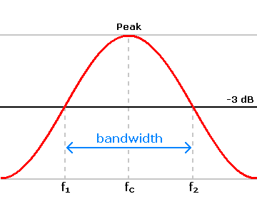
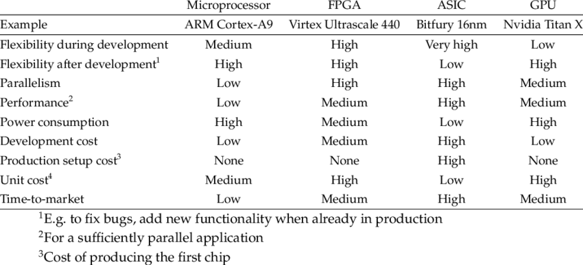

Since 2016, India has been one of the fastest-growing markets for the internet. It almost doubled its internet penetration in half a decade (2016-2020), and the average broadband speeds increased by 77% in just one year (2016-2017), while mobile speeds improved by 42% in the same year ([source](https://www.speedtest.net/insights/blog/global-speed-2017/)).

In 2020, Amazon was hit with the then-largest known DDoS attack of 2.3Tbps, while the very next year, an attack of 2.4Tbps was defended by Microsoft. Have you ever wondered about the changes under the hood required to support such high bandwidths and mitigate such an attack? If yes, this post will introduce you to some of the technologies involved.

_Note: This post is not comprehensive by any means and barely covers the beginning of the surface of the technologies involved._

## The Bandwidth Problem

Let us first begin by understanding the most fundamental problem of the internet. Bandwidth. What is bandwidth?

The above image is a graph with frequency on the X-axis and amplitude on the Y-axis. Bandwidth is essentially the range of frequencies that someone can do something with. The bandwidth problem arises when too many people use the same small range of frequencies to communicate.
A real-life example might be a tiny overcrowded room where everyone is trying to talk. It becomes challenging to listen to anyone there. The same situation happens for computers when trying to talk to the internet. Some of you might have a broadband connection at home, and if it's one of the newer routers, you might have observed a 2.4GHz and a 5GHz option in it.

In reality, 2.4GHz ranges from 2,400 to 2,483.5 Mhz (approx, actual values depend on the country you live in). On the other hand, ranges from 5.15GHz to 5.35GHz and 5.725GHz to 5.85GHz. As you quickly notice, the total bandwidth for 2.4GHz is ~80MHz, while 5GHz is ~325MHz, about 4 times higher! But the problem with a higher frequency is that the signal strength drops more quickly (called signal attenuation), resulting in less range.

As you can see in the screen recording above, there are very few devices talking at 5GHz (because of the quick signal attenuation, and none of them overlaps. But the story is very different when we look at 2.4GHz (end of the recording).

While the above detail is WiFi Specific, the same applies even to Mobile Data and wired Broadband. This is one of the primary reasons India is still one of the lowest on the Speedtest Global Index - Mobile (source). Due to its large population, there are always too many people trying to use the same limited bandwidth available to them at any given time and place.

But while airwaves are a limited and costlier resource, wired systems are less resource-constrained in that aspect. Hence, India has been rising in average broadband speeds and penetration in the last half-decade. But this leads to another problem. If everyone has access to high-speed internet, you need systems that can simultaneously handle the high traffic load from all those users. In other words, you need a faster 'system'. And this 'system' should also be able to ensure security and mitigate attacks like the one on Microsoft and Amazon.

**Addendum:** While Internet Service Providers (ISPs) say they give you a particular package with some specific speed, you should note that they write the word 'upto' next to it. This exists due to a system called Thin Provisioning. Let us assume an ISP has 1Gbps of bandwidth. It can promise 5 users 200Mbps, always. But most normal consumers rarely utilise 200Mbps constantly. And hence, the ISP can promise 'upto 200Mbps' to 20 users (the exact number depends on the ISP and the demographic), knowing that these 20 users, on average, will never use >1Gbps at any given time.

## The "System"

First of all, this 'system' is not one piece of technology. It's a collection of many hardware and software technologies from many companies. Below is a non-comprehensive list of technologies definitely involved in giving you internet access.

1. Routers
2. Switches
3. Carrier-Grade Network Address Translation (CGNAT)
4. Proxies
5. Load Balancers
6. Firewalls
7. Servers and their associated acceleration hardware and software.

There are enough resources on Routers and Switches, both on the internet and introductory networking textbooks. And the rest of them are exciting enough on their own to warrant a separate post (maybe someday). But for now, let the focus be on a relatively new hardware capable of doing most/all of the above-stated functions at a very high speed and low power consumption. This new technology is called a SmartNIC (a Smart Network Interface Card).

## The SmartNIC

Before understanding a SmartNIC, the first step is to understand FPGAs, ASICs, and Microprocessors. Most of you have already heard of microprocessors. It's the same 'processor' on your laptop or phone, nothing new.

The above comparison shows that FPGAs are faster than microprocessors but consume more power than ASICs. While ASICs are the quickest and consume the least energy, but can (rarely) be modified. ASICs are usually designed for a specific purpose, and they are the most efficient in doing only that task.

With that overview, let us now understand what a NIC (Network Interface Card) is. As the name suggests, it's a piece of hardware that you use to communicate with the network. It could be your WiFi hardware, LAN/Ethernet Hardware or the hardware in your phone to communicate with the mobile towers. Most of these devices are 'dumb'. They only have some memory (buffer memory) to store the incoming and outgoing transmissions alongside hardware to encode/decode the signals on the chosen medium (WiFi, LAN etc.).

But SmartNICs are high-speed NICs specifically for wired transmissions (LAN, Fiber Optic etc.), which have a combination of any of the above 3 (ASIC, FPGA and Microprocessors) on them. Confused? That is expected! Why in the world would someone put a processor or something similar on a network card? What purpose does it serve? Let us understand.

The first thing we need to accept is that the internet-based network is designed to be highly parallel. Every transmission has the 7 layers of the OSI model. And each layer has multiple packets, each of which can be decoded separately, in parallel. So, in theory, for 1MB of data, divided into 10 packets of 100KB each, you can have 10 `<acceleration hardware>` to process each packet. The processor on your laptop has multiple cores, but it's limited to a small amount (1-12, usually). Servers go a bit higher with the core count in double digits and rarely, even three digits. But when we are talking about tens or even hundreds of Gb per second of network data pouring in, we need something that can be massively parallel, and general-purpose processors are just not designed for this job.

Each general-purpose processor in your phone, laptop, or server has a minimum frequency. The processor can not go below this frequency without entering 'deep sleep' mode to conserve power. Power consumption in a processor increases exponentially with the frequency. In the case of parallelly processing a large number of incoming packets, you need either specialised hardware or, at the least, a large number of cores. But having many cores also means a more significant power consumption.

This conundrum between the choice of ASICs, FPGAs and Microprocessors is why SmartNICs have a combination of any/all of the above. A SmartNIC with an ASIC and a microprocessor can essentially run a bare-bones Linux on the SmartNIC. This increases the ease of programmability for more complex tasks or solutions that were not conceived when the SmartNIC was built. While the ASIC on the SmartNIC can do the general/regular jobs at a fast rate, with very low power consumption. An example of this is [Intel's QAT](https://www.intel.com/content/www/us/en/architecture-and-technology/intel-quick-assist-technology-overview.html). QAT on a SmartNIC or an [Infrastructure Processing Unit (IPU)](https://www.intel.com/content/www/us/en/products/network-io/smartnic.html) can provide features like encryption/decryption of data at line rate (essentially without any delay), with speeds as high as 100-400 Gbps. The configuration of the QAT (or any ASIC) can be easily done by the onboard processor on the SmartNIC/IPU.

Another example of the feature set that a SmartNIC can provide you comes from the [Mellanox Bluefield 2](https://www.nvidia.com/en-in/networking/products/data-processing-unit/). This SmartNIC has a host of features. One of them is the DMA capability. DMA stands for Direct Memory Access, meaning that the SmartNIC can directly access the RAM of the host server without the host processor as a mediator. And this does seem like a security vulnerability waiting to be exploited. But I believe that this is not any more vulnerable than having a regular server without the SmartNIC*. The DMA opens a host of possibilities. For example, you can theoretically offload TCP de-packetisation on the NIC. This means you can de-packetise all the way to Layer-4 of the OSI model on the NIC and then just put the de-packetised data in the application memory.

With these capabilities, a SmartNIC is an ideal drop-in solution to perform many networking-related tasks like hosting a proxy, load-balancing, running a CGNAT, performing encryption/decryption, running a firewall/protection service, hosting a service-mesh proxy sidecar of Kubernetes etc. And all of this can be done with no load on the host's CPU, which is free to carry out the actual Business logic the company desires to run.

\* The purchase of SmartNICs is a B2B transaction, as ordinary consumers like you and me do not need this. So, the hardware trustworthiness is the same as trusting Nvidia for their GPUs or Intel/AMD/Qualcomm/Ampere for their processors. The OS on the Bluefield 2 is Linux, and you can configure it to be any Linux that your enterprise uses, thus reducing the vulnerability. And finally, the programs that run on these are written by the enterprise's employees.
