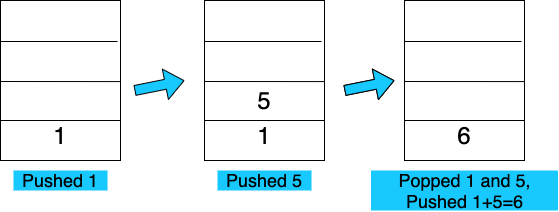
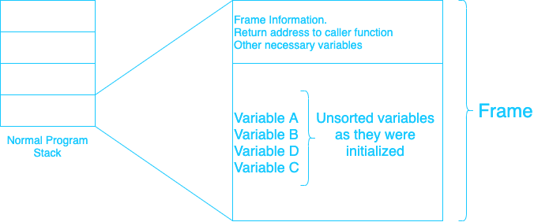
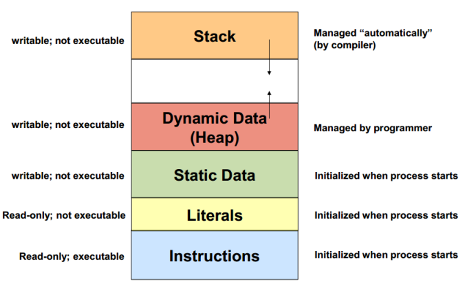
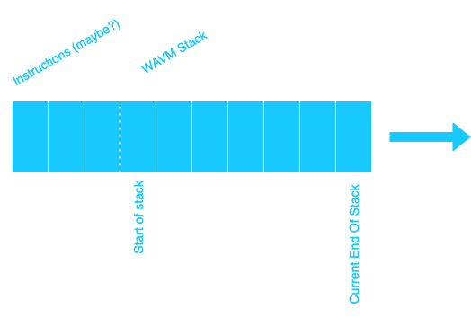

# Motivation

So you know how one day you are writing "Hello World" in C, and the next day you are figuring out which pointer/reference goes where in a thousand line code? It's weird!

Pointers in C are an excellent way to gain low-level control, but your average developer is usually not that careful and creates a mess of pointers more often than not. And it takes a lot of extra effort to be careful when playing with pointers in C!

Another major problem, which affects even the relatively newer languages, has something to do with importing modules. All the modules you import while writing the code run with the same privileges as the main program. You write the main program and know it is not malicious. But almost no one bothers to check if the modules they imported are doing something they are not supposed to do.

This becomes a more significant concern with technologies like NodeJS and npm. There are literally thousands of modules imported because a module you import will probably import many more modules! And you can't possibly check all of them for malicious code every time they update. 

And the final problem of everyone, may it be large MNCs like FAANGMULA or a college course project team, everyone has a problem with the choice of language!

I personally am a fan of Go! And Dart/Flutter and do not like scripting languages much. While someone else might be completely opposite. And it's challenging to decide which language/s to choose for a project.

WebAssembly tries to provide a solution to all the problems stated above.

In short, WebAssembly provides these 3 significant features:
1. Separate Code memory from runtime memory
2. Explicit permission for each module
3. Cross-language module support

Alternative video explanation:
{{Of07IsplHPY}}

# History

But that wasn't how it all began. WASM began with the idea that Javascript, the dominant language for the web, was inefficient and had security problems. The inefficiency for JS comes from the fact that it is an interpreted language.

This is a fundamental problem with all interpreted languages, which basically comes from the interpreter compiling each line of code. For more information, you can check out the Introduction part of the Compilers and Interpreters
.
So, the idea of ASM.JS emerged. It is a subset of JS which allows C or similar code to run as web apps. This idea then evolved into WebAssembly or WASM.

WebAssembly's core idea is similar to what Java has with JVM, which is to have a Virtual Machine as a compilation target. Hence WASM provides an ISA which the compilers can target. But it has a cherry on the top. The WASM ISA's binary has a one-to-one correspondence to a textual (human-readable) format, making it easier to debug the binary. More information on the JVM can be found in the Introduction part of the Compilers and Interpreters. 

And so the most obvious question is why not use the already existing and mature JVM or something similar? Well, just as every elderly person has a set mindset from the era they come from, JVM carries a suitcase of problems and inefficiencies and features that have evolved over the years. And it would be much more efficient in the long run to develop something from scratch, after learning from all the mistakes and issues of JVM and the likes.

This brings us to the WebAssembly Virtual Machine or WAVM.

A simple "Hello World" in Java takes up around 10MB of RAM. While the WAVM has a significantly lower overhead amounting up to just a few KBs.
Compared with JS, Chrome's v8a takes around 5ms to load, while WAVM takes around 50µs to start. This is 100 times faster!
Obviously, the executed code might not be a hundred times faster as it depends on the code's complexity, repetition, etc.

WASM is a compile-time target ISA for many languages like C, C++, Go, Rust, etc.
In theory, it can at least support any language that supports LLVM (TODO: Link change to LLVM sub-section).
And while WASM is relatively new, it has developed leaps and bounds. A significant reason is that it is open-source, and hence multiple big tech companies are collaborating on it.

Autodesk has launched a web-based AutoCAD using WASM, which shows how capable WASM is.

# WAVM

Let's try and understand WAVM a bit more. It is a stack-based virtual machine.
Let us first understand what a stack-based VM is.



Imagine an ISA with just 3 instructions: PUSH, POP and ADD (2 numbers)
So if you want to do $ 1 + 5 = 6 $, what you do is:

```
1. PUSH 1
2. PUSH 5
3. ADD
    - This calls POP twice (automatically)
4. PUSH <RESULT>
```

This is how a stack-based VM essentially works.

Most of our standard computers are register-based machines, though. Where each register can store one value. A register is nothing but a pocket of memory.

So there, the instruction looks something like `ADD $<output-register>, $<input-register-1>, $<input-register-2>`. As you see, the instruction's length increased. Instead of just `ADD` it now is `ADD x,y,z`

Stack-based machines assume that their instructions need N variables, which are already on the stack in the necessary sequence. This reduces the instruction size.

Hence, a command like `c=a+b`; would translate to `ADD c,a,b` in register machines and `PUSH a; PUSH b; ADD` in stack machines.



Now you may have heard that every executable has a stack and heap memory. DO NOT confuse that stack with this stack.

That stack holds frames (see diagram above). Each frame corresponds to a function, and inside each frame, you have your variables etc. which correspond to that function. Those variables are mostly ordered as they are initialised in the code and not as a stack from which the instructions can pop.

# Sandboxing

As mentioned before, WASM takes the idea of zero trust and minimum privilege to a new level.
How does it do that?

A typical program's memory looks like this:


The stack (the one which stores frames) grows downwards, while the heap grows upwards.

The problem with this is, you can essentially grow the stack so much that it ends up overwriting the heap, static data, literals and eventually instructions. And if you are smart enough, you can rewrite the binary in memory while it is executing, thus making it do what you want instead of what it was designed to do. For more information, you can check out the First project of MIT OCW's 6.858 courses.

NOTE: As written above, the stack is non-executable while instructions are executable but read-only, which avoids the issue stated above. But, this was a feature added much later.
WASM memory is quite different from this.

It takes the form of linear memory. So there is no concept of a heap growing up and a traditional stack growing down. It's just an array that can be addressed.



NOTE: I could not find online if the instructions are just before the WAVM Stack or not.

Also, I called it WAVM Stack to distinguish it from the usual program stack we discussed before.
As the diagram above shows, the stack grows towards the right, and the memory can be represented as an array starting from zero. And you just need to hold two main values.

1. Start of the Stack Memory (Bottom of the stack)
2. End of the allotted Stack memory (Top of Stack)

And this happens for each module you call.

If an instruction needs to access direct memory (instead of popping the stack), the location is START+X.

Also, this linear memory structure ensures that there is no way the WAVM stack grows and ends up overwriting your code. Because the stack grows AWAY from the instructions and not towards it.

It also can't access any other memory as the VM knows the start and end of the memory and checks those bounds whenever direct memory access occurs.

This implies that each module remains in its own sandbox and can't access anything outside its sandbox. It also can't overwrite its own memory in an attempt to execute arbitrary code. This also means that data has to be explicitly passed to any module so that it has access to it.

I searched but could not find if this isolation explicitly exists for each module you import in a code or not. i.e. If module A imports module B, is Module B isolated from A such that neither can access each other's memory or at least that B can't access A's memory? But given the reasons why WASM is secure, it would be safe to say that at least the latter would be a possibility.

This brings us to WASM's 3rd feature of permissions of sandboxed modules.

If you import a module B in module A that you wrote yourself, B does not get any permission that A has. i.e. if A is running as root (assume), B still can't modify arbitrary files or do anything the root can. It remains in its sandbox, with the only capability of executing its own code.

To give permission to module B, you have to explicitly mention any and all permissions that it needs while calling it. So, if you know that module B intends to modify files in ~/dir, you can choose to grant explicit permission to B to access files only in ~/dir and nowhere else.

This is really helpful when you are importing hundreds or thousands of open source modules in your code, and you may never know if one turns out to be malicious!

This concludes our introduction to WebAssembly. Hope this helped you understand it from the very basics. If you think I should have added or elaborated on something, or if you find an inconsistency in this article, do let me know!