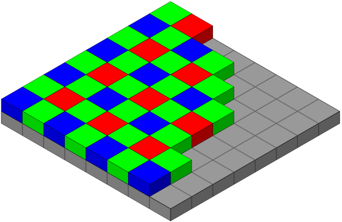
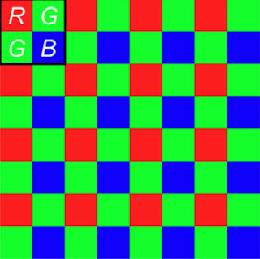

Hello, I am a photon, and my name is Mike! And today, I am going to describe how my friends and I became immortal. Well, almost immortal. As you see, my current state is very similar to Lord Voldemort. I have multiple copies of myself today, and if all of those copies die, I die. But no, I am not evil and certainly not a child murderer.

So, let's begin!

## The beginning

I do not remember where I was born. All I remember is that I was suddenly travelling at about 299792458 m/s, travelling through emptiness. There were, I don't know know how many of us there. It was about 500 seconds later that we suddenly slowed down a bit. And instead of travelling straight, we were starting to go off in different directions!

We had just entered the atmosphere of a planet the natives call "Earth", and the others call "TerraForma" or "Terra" for short. This planet had an atmosphere, and because of it, many of my peer travellers [deviated somewhere](https://www.youtube.com/watch?v=v5SuSB_93FM) else or lost energy or both, giving the atmosphere a [beautiful hue of red and orange and golden and blue](https://en.wikipedia.org/wiki/Golden_hour_(photography)).

I. luckily, made it all the way through to the surface. There, again, some of the other photons with me hit some objects and deviated from their trajectories. But I was still going straight. Oh no! I am about to hit something!

And so it all began. My journey to immortality

## Path to immortality

I just hit a small beautiful child playing on the beach, making what should have been a castle, but it was more like an inverted bucket. I was thrown off my path. But I was not alone. Some of us had gone through the same deviation (called refraction) multiple times already! We were all heading towards this giant piece of glass.

As soon as we hit that, all of our paths started converging. We hit multiple glasses*, which kept converging our paths! Eventually, we reached this giant mirror. And we all were afraid that this was the end. But instead, at the very last moment possible, the mirror lifted up**, and we instead hit a very electrifying object. 

\* A typical camera lens has multiple elements (of glass), each helping the image converge. Good lenses have fewer elements as each element is not entirely transparent and has impurities, which cause minor changes to colour, brightness, etc. 

** The time for which the mirror is up and the sensor exposed is the exposure time of the image. More prolonged exposure means that the sensor collects more light and hence is brighter. But as the light is captured for an extended period, all of the object's positions will be captured if it moves in that period, rendering a blurred image.

## The transformation

There was a filter called a [Bayer Filter](https://en.wikipedia.org/wiki/Bayer_filter) that we hit first. Those of us who matched the frequency of the filter (i.e. the colours it allowed) where we hit, made it through. The rest of us were sent (reflected) back.

Surprisingly, from the remaining ones of us, there were twice as many of us corresponding to the green frequency compared to either the red or the blue, which were equal. We later learned that the human eyes perceive almost twice the amount of green than red or blue, so they had replicated that on their filters!

Here, I will take a slight deviation to tell you how this filter works. We will refer to the diagram below. 

In most cameras today, this grid is aligned over the sensor and reflects all light that does not match the colour at that position. And one block of 2 greens, 1 red and 1 blue, together make one pixel. So, a 12MP camera has 12 Million such pixels, each containing 4 photosensitive sites. But some new phone manufacturers use each of these sites as an individual pixel.

To know how this is done, let's take a Green unit from above. The value of its Red would be 0 as all red light would be reflected. But I can assume that the red light there is the average of the red to its left and right. Similarly, its blue value would be the average of the blue values of the units above and below it. This leads to a loss of sharpness and colour in the image.

So, when a phone advertises a 48, 64 or 108 MegaPixel camera, this is it. And this is why some phones with a 12MP camera have better sharpness and colour than a camera with more MegaPixels.

Moving on, the rest of us then hit another object, the electrifying object that I mentioned before. And our lives came to an end. But our end brought to life* some of our cousins from Uncle Fermion. Oh, by the way, we all belonged to the family of Bosons, if you were curious.
Our cousins represented us in quite a few aspects, especially the memory of everything that we knew. So, in simpler terms, I can just say that we transformed from a photon to an electron.

\* Note: In reality, photons hit a photosensitive material and transfer their energy to electrons. The electron, now having enough energy, decides to escape the atom it was bound to. Many such electrons combine to create some current, which is sensed by the sensor. A larger sensor will have larger photosites and hence capture more amount of photons in unit time. This is why a DSLR performs better at night than a phone at the equal MegaPixel count.

## The journey as a transformed being

So, now I am an electron and so are all the ones who were travelling with me. I have made some friends along the way too. I especially like Stephen and Marie, who are very similar to me and have been close to me since we bounced off that little child earlier.

We are all moving through this grid towards a corner, presumably the exit. We reach there and realise that we are all being shown to our temporary living quarters, the Buffer Memory. It is a place where all the photons that could make it while the mirror was lifted up get to stay before they become immortal. Here, it looked like we were placed in the same manner as we were after we had bounced off that child. Which was a good moment for me. I had both Steph and Marie next to me!

Soon, we were called to go to the processing centre, which would make us immortal! But a weird thing happened as soon as we were in the processing centre. There were two of me, and two of Steph and two of Marie! And we had no idea what was going on! Turns out the user of the DSLR had opted for a mode called "RAW + JPEG". And this mode required there be 2 copies of all of us. So, the processing centre created a duplicate of all of us.

A copy of us was sent to the next place. It looked similar to the Buffer Memory before, only a lot bigger. It was called Random Access Memory, or RAM. I wasn't one of them, and hence, my journey continued into other parts of the processing centre. The next room we went into was called [JPEG Compression](https://en.wikipedia.org/wiki/JPEG)

## A Tiring Merger

In the JPEG compression room, we were evaluated a lot of times. A computer running a lot of mathematical gobbledygook* would come to us and keep testing us for various parameters. It would then segregate the ones of us who were similar, according to it, into a group. I wish this thing was with me right from the start. I would have made a lot more friends like Steph and Marie! Anywho, they are still here with me, and now I have a lot more friends too!

And while the computer was doing its tedious task, we all decided to play some card games and pass some time. Soon, the evaluations were done. Suddenly, we saw that in some other bunches, our brothers and sisters were merging into each other. And the combined entity had properties that were more or less the average of all the brothers and sisters that merged. Soon came our time, and I, Steph, Marie and the others were merged into one**. 

"Heya! Steph here. I am going to take over this narration now. We were all merged, and so I know the same things as you do. So let me continue."

"Urgghh..!! Fine"

After we were merged, we were handed a small card with some cryptic numbers** on it. At this point, we had no idea what those numbers were for. But we were told to keep the card safe, and so we did.

\* If you want to know this gobbledygook, please watch this [video](https://www.youtube.com/watch?v=Q2aEzeMDHMA).
** The merged entity is just another pixel. JPEG compression essentially averages the colour and intensity of nearby, similar pixels and then stores only that pixel and the times it has to be duplicated. This results in a minor difference in the colour and intensity of a pixel when the image is viewed. This is why JPEG is called a "lossy compression". For more information, see the video mentioned above.

## The End

All the merged entities then headed towards the RAM to sit alongside the copies of ours created some time ago. We waited there for some time. And then, we were approached by someone who claimed they were sent by the Direct Memory Access (DMA) controller. It claimed it was here to take us all to where we would stay for a long time, a place called "SD Card". We reluctantly followed it to a bus dubbed the "System Bus", which took us all the way to the SD card. We are now immortal, living here in the "SD Card", being lazy. Not a worry in the ...

Knock! Knock!

world? Who might that be now?
