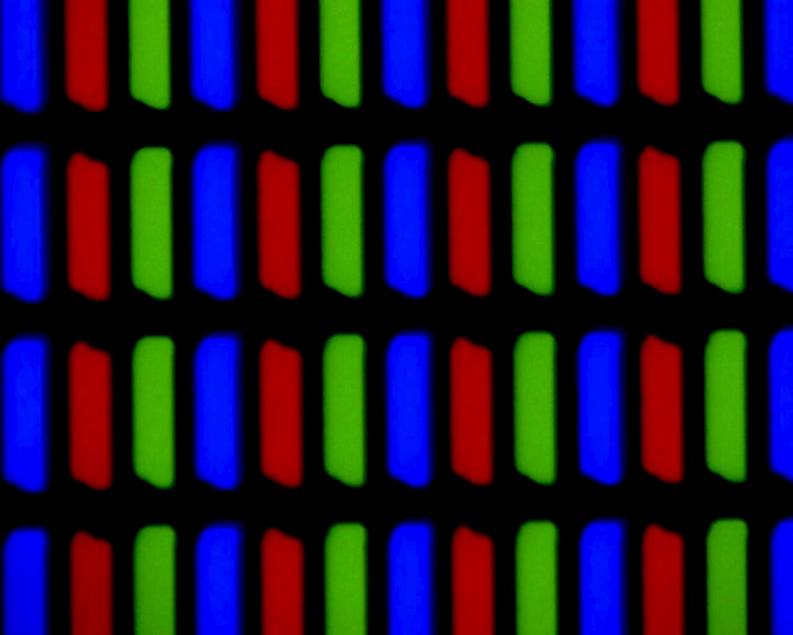

Heya there, Mike here! I hope you remember me from the previous story of "Photons to Photos". If not, please read that story.

Let's continue from where we left off!

So, it turns out that the owners of the DSLR wanted to revisit us. For that, they had removed our permanent place of residence, the SD card, from the DSLR and put it in their laptop. So, now it was another entity who claimed it was from another DMA controller who would take us to another RAM, this time belonging to the laptop.

And so we are off again, this time to meet the owners of the DSLR. In the RAM, we saw a lot of pictures already present alongside us. And more of them were coming in. We were all being loaded into some application that would enable the DSLR Owners to see us and even change us!

## The first contact

As soon as the application had loaded us, it sent us to a chamber called "JPEG Decompression" (remember JPEG Compression chamber from the previous story?). We were asked to hand over the card with the cryptic numbers to the evaluator in this chamber. Most of us possessed this card, and we were quickly re-split into our individual selves. But a few merged entities did not have those with them, and they were deemed "corrupt" by the system, and the owner went ahead and erased them! Now we were extra-careful to never lose those cards, lest we lose our immortality. 

The rest of us made our way through to another buffer memory called the video buffer and were soon displayed on the monitor. It took precisely 1/60th of a second for us to move into and out of the video buffer. The monitor refresh rate of their laptop at 60Hz was the reason for this. This was our first introduction to the humans, and I enthusiastically tried to talk to them. But apparently, they were not able to see or hear us individually and only saw the picture as a whole. 

## The timelapse

We were a part of a series of photos taken at constant intervals to make what humans call a timelapse. It is funny for us as most humans consider time to be absolute, and that partially comes from the speed at which we travel in space! But in reality, time varies relative to your speed versus mine. But I am not here to teach you advanced Physics. And anyway, you would be bored before I even begin.

The owners were using professional-grade software to colour correct us and create a timelapse out of us. Unfortunately, I do not remember the name of the software, but I do remember it was something that fell into the category of a non-linear video editor (NLVE). The owner placed us all side by side on a timeline and told this computer to run its gobbledygook and play each of us for precisely 1/30 seconds. Let us take a slight detour to explain human videos.

So, most human videos (except games or anything interactive) are a series of photos played quickly. Each picture is called a frame, and the number of images displayed per second is the frames per second or FPS. Most videos vary between 24, 25, 30 or 60 FPS. And the owners here were making a video at 30 FPS, and hence we were each played for 1/30 seconds. 

## The enhancements

The humans were not satisfied with the look and colours of the timelapse and decided to enhance it according to their taste. The NLVE they used allowed them to do this efficiently. The application divided us into multiple categories according to our brightness, colour, hue, etc. Each was presented as a separate colour wheel to the user, who could manipulate a selected colour and change it to whatever they desired. 

The owners could now select those who matched a particular brightness, colour, hue or saturation and change our colour to match their tastes. They enhanced me and those like me who were on the child's face, thus enhancing the glow on the face. The child now looked a lot more happy and cute, and the image itself looked eye-catching!

## Becoming a video

After the owners were satisfied with how the timelapse looked, they decided to save the timelapse they had created. This again involved a lot of computer gobbledygook. This time, all of us were again compressed using the JPEG compression as before. And we were all handed the same cards with cryptic numbers. 

But this was only the first step. In the next step, we were again evaluated. Only those of us who varied in position or changed properties compared to the previous frames were stored. And each picture was also given a separate card with other cryptic numbers on it. Surprisingly, some of the frames were an exception to this and retained their full JPEG compressed versions.* 

Then we all made our way back via the RAM, the system bus, etc., and landed up in the laptop's Hard disk. Here we remained as a video until the next day when we were called up again and transferred to a phone.

* A video compression has 2 parts: image compression (e.g. JPEG, PNG) and inter-frame compression. Each video has some frames called key-frames, which are compressed images. And the rest of the frames are just stored as the difference between the previous and the current frame. This is why you may have sometimes noticed that your video turns [grey and remains grey for some time](https://youtu.be/vXHFnpV8WA8?t=30), only showing colour where the pixels have changed. When your key-frame did not load properly, the rest of the frames only show up as a difference, and that's all you see. That is until the next key-frame loads, after which everything looks normal again.

## Back to basics

Once we were transferred to a phone, its owner forwarded us to their friends and family using social media applications. I stayed here for an entire earth year. After a year, one of the applications reminded the user of my existence. And they decided to relive their happy memory by watching me and this timelapse again!

So, I travelled back from the phone's storage to the RAM and the video buffer memory later. Once I was in the video buffer memory, a driver manipulated the pixels on display to replicate the image that needed to be shown. And here, we take another detour to explain how I get transformed back to a photon.

A driver tells some hardware attached to the monitor to manipulate the pixels on display. There are 2 significant types of displays available today: [Liquid Crystal Display (LCD)](https://en.wikipedia.org/wiki/Liquid-crystal_display) or [Light Emitting Diode (LED)](https://en.wikipedia.org/wiki/Light-emitting_diode)

Most of today's LCD (Liquid Crystal Display) monitors are LED-backlit, but this is not the same as an LED display. In the LCD, the backlight is a source of white light which is the size of the monitor itself. It could be any light source, but most of today's LCDs have a white LED panel as the backlight. Another layer of Liquid Crystals, which can be polarised and manipulated using electrical modulation, sit in front of this backlight. These crystals then block the light that does not belong to the required colour and let the rest of it pass through, much like the Bayer Filter. Thus the user only sees the colour intended at that pixel.

On the other hand, Light Emitting Diodes are tiny light sources of either Red, Green or Blue (RGB) colour. Each group of RGB forms one pixel. The driver manipulates each of these LEDs individually, turning them on and off as required. This is why 'dark mode' on phones became famous. For showing pitch black (darkness), all the driver has to do is switch off the LEDs in that region. This also saves power and hence is used to conserve battery.

A third type of display also exists, called the E-ink display, the kind you find in e-book readers. These displays are lower in resolution (quality) and are primarily black and white. The e-ink display has tiny pixel size globules of ink that can be electrostatically manipulated. If the ink is in one position, it absorbs the light. If it's in another position, it reflects the light. This is really helpful as the only time power is consumed is when you want to change the content on display. And this is not done often when reading a book. But each change takes a lot of time and consumes a lot of power. This results in the inability of e-ink displays to show videos. More information on e-ink displays' working can be found [here](https://www.youtube.com/watch?v=6NRT8E5-reM)

Back to the main story, this was a modern phone with an AMOLED display and hence worked just how the LED system above described. This way, I was split into 3 channels, one each for Red, Blue and Green. Now, these 3 parts of me were sent out as different photons from the LED. But the user saw us as a single colour, unable to distinguish between us individually!

And now I am back travelling at about 299792458 m/s into the unknown. Let's see where life takes me next! Meanwhile, a copy of me exists on this user's and multiple other phones, if you ever want to talk to me! 
