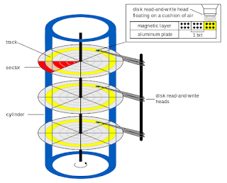

Let us continue from where we left off. That is from the time when your request's packets were delivered to Google's Data Centre.

## At Google's Data Centre (Cloud Computing)

1. Your request has now travelled through multiple routers and switches throughout the internet and reached a google Data Centre (DC). 
    - This is a specific request, which is requesting a search result, and hence it hit a DC. 
    - Suppose this was a generic request like the homepage of google or the login page of Facebook, which is static (constant) and does not vary. In that case, your request may not even go all the way to a DC of Google/Facebook and instead be served by something called CDNs (Content Distribution Networks).
    - CDNs are servers that store and serve static files like HTML, CSS etc. So, if you open Facebook and login, the HTML, CSS and JS of the page, i.e. content like the formatting, background colour, feed blocks, sections, icons like home and settings etc. are served by CDNs
    - The loaded Javascript then sends requests to the Facebook server for the posts you see in your feed. This is dynamic and changes with time or is user-specific, and hence CDNs can't serve them.
2. At the DC, Google has a load balancer that will determine which server your request will go to.
3. The DC contains multiple physical servers, most of which run some flavour of Linux.  There are distributed computing systems like Kubernetes (k8s in short) and borg that run and manages these physical servers.
    - [Containers](https://www.docker.com/resources/what-container) are packages that contain all the components necessary to run a particular program or service. So there would be a container running the 'search' service of google.com.
    - Multiple such containers are managed by k8s and are scheduled on the physical servers. There can be 100,000 containers all doing just the one specific task of serving search results.
    - The load balancer determines which container in which physical server will serve your request. It balances the load across all the physical servers so that your request gets served as quickly as possible.
4. There is another service (maybe another 100,000 containers?) that runs on those servers. This service crawls through the internet and index and store information about the websites. 
    - There can be separate devices with multiple hard drives and SSDs to store a vast amount of information. 
    - They can also have a separate microcontroller that serves the content of those drives over the network to the service that requests it. 
    - That device maintains a track of which track and sector the data is stored in. As the image below shows, each drive is divided into layers, tracks and sectors.
    
    - Another microcontroller, inside the physical hard disk, will do the actual job of reading the bits from each disk-track-sector and sending it to the cluster's microcontroller mentioned above.
5. At the server, your packets are de-packetised all the way back to the Top Layer in the [OSI model](https://www.geeksforgeeks.org/layers-of-osi-model/). And the request is thus determined. The search service will determine which of the hard disk clusters contains the information you have searched for, request the cluster's microcontroller there to fetch and send that data. 
6. There would be yet another service, this time running some sort of Machine Learning algorithm that would notice your current query and prioritise the results based on your previous queries. 
    - For example, if I have searched a lot about insects and plants in the past, searching 'bugs' will yield me results of insects.
    - Instead, if my search history contains a lot of queries regarding computer programming, searching 'bugs' might yield results more relevant to computers and code.
7. The prioritised results will then be packetised the same way as described in part 1 of the post. And sent back to you the same way. Your request contains the destination IP address of your computer or the last router on your path. And hence the service knows where to respond to.

## Showing the results to you (Computer Graphics)

1. Now this time, the request would be received by your WiFI/LAN hardware and stored in your receive buffer on it. It also raises an [interrupt](https://www.geeksforgeeks.org/interrupts/).
2. This interrupt is served the same way as the previous one, except that the ISR and the Driver will be different this time.
3. Now, the request and response's transport layer (refer to OSI model) contain a port number, which is the unique ID of the requester. Hence the OS knows exactly which program/process to forward the data to. 
4. Now that chrome receives your search result, it will parse the HTML, CSS and JS associated with it.
5. HTML and CSS, as mentioned before, tell you how to display something. So, your browser will parse them.
6. But your display is just a collection of Red, Green and Blue (RGB) pixels. It does not understand anything except which colour to show and at what intensity (brightness).
7. So your processor, or better yet, your GPU, determines exactly which pixels need to show which colour and at what intensity, which in itself is a complex task.
    - It is complex as HTML just says, show this text in black colour and font size 12. But which exact pixels to light up so that a 'd' looks different from a 'cl' is something the CPU/GPU has to determine.
8. Then those instructions on which pixel to light up and sent and stored in another hardware called a display buffer, which is then used by a controller attached to the display to actually light up those pixels and display the results.

So, this ends how you get a search result back. As you see, there are many steps involving a lot of complexity. I always admire how easy it is to google something and get the results back in a few milliseconds, especially when I am aware of the complex stuff in the background.

P.S. If you are interested in knowing more about the click's journey, it left a travelogue too.