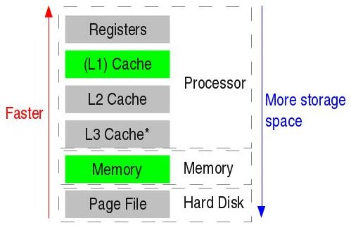

**Warning:** This article goes scuba diving into the depths of computer systems, networks, security, and many other fields and is not for the faint-hearted. It is okay if not everything in this article makes sense to you, especially if you are an undergraduate or have just graduated. Also, this article will take a lot of deviations to go explain some technology in detail.

## Touch Input

1. Most of today's smartphones contain a capacitive touch screen. A capacitive touchscreen comprises 2 layers, each having a grid of units of some conductive material. One of the layer's units are connected row-wise, and the other's column-wise.
2. Those 2 layers are separated by an insulator, and one of the layers is negatively charged. So, by default, all the units of the other material are positively charged.
3. When any conducting object, like your finger, touches the screen, the charges in that area get disrupted. Now, because units of one layer are connected row-wise and the units of the other column-wise, it becomes easy to detect where the finger touched.
    - A more visual explanation can be found here.
4. Each input device, like your touch screen, mouse, keyboard, camera etc., have a tiny memory buffer where they immediately store the input until the processor decides to serve the interrupt that it raised.

## Recognising the Input

1. Once the processor decides to service the interrupt, it runs the ISR and hence the driver of that input device, which resides in the kernel.
    - Your processor has multiple modes called rings. 
    - For x86/amd64 based systems, ring 0 corresponds to "all privileges", and ring 3 corresponding to "least privileges". Ring 1 and ring 2 are not relevant here.
    - For arm-based systems, they are called "Supervisor mode" and "User mode."
    - More details can be found [here](https://www.youtube.com/watch?v=85eINAowuMc) and [here](https://en.wikipedia.org/wiki/Protection_ring)
2. The kernel needs to talk to the hardware, which requires special privileges. You don't want your programs to directly access hardware and read data off your keyboard or watch you through the camera, right? Hence, the processor needs to run in ring 0 or supervisor mode.
3. Even in your RAM, there are 2 parts, one belonging to the kernel and the other belonging to the applications. In the applications' part, each application is isolated and can't access anyone else's memory.
4. But the problem is, your computer has multiple layers of memory, as shown in the diagram below.

5. You do not want one application of your computer to read the data of another application. Hence, every time there is a context switch, i.e. another application or the kernel will now run on that processor or core, all the caches get evicted.
    - More information on cache and memory can be found [here](https://www.youtube.com/watch?v=_kZY4orPQW0).
6. So now, all your caches evict, and the ISR and the corresponding driver run in ring 0 or supervisor mode. Once the input's information is parsed, the foreground application is determined, and a signal is raised to that application, in our case, Google Chrome.
7. The application, when coded, needs to have a handler for that signal, without which the input is neglected, or worse, the program crashes. Chrome would have a handler to take in the signal, read it as a click/touch input and do the rest of the task of determining what to do with the input.

## Life of a packet

1. The OSI model is designed in such a way that each layer is pluggable. You can remove TCP from the transport layer and put UDP while keeping the other layers constant, and in theory, it should work seamlessly.
2. But because there are issues in real life, like interference, some layers, like MAC in the data-link layer and TCP in the transport layer, have checksums. They are hashes over the data and the headers. This allows them to determine whether the packet was destroyed while in transit. 
3. This adds additional overhead. Because you have to recalculate the hash and check with the checksums always. Not to mention the header size increases due to the checksum. All in all, networks aren't efficient and consume more data than is actually relevant.
4. But we forgot the part where your data needs to be secure. And this is mainly done above the transport layer.
    - There are many ways to securely transmit data over the internet, but the most common one you use is the public-private key system.
    - Imagine two big prime numbers like 10006177 and 10006699 (or even longer). Now multiply them, and you get a new number 100128801379723. If I give you this product, can you tell me the 2 prime numbers it came from? Maybe you can, but it will take a lot of time and effort for you or even a computer to do that.
    - This is the basis of the public-private key system. A mathematical explanation can be found [here](https://www.onebigfluke.com/2013/11/public-key-crypto-math-explained.html).
    - Everyone can have the public key. The data is encrypted through this. But only the one with the private key can read that data.
    - So, a server sends you its public key, and you encrypt your data using it. And only the server can decrypt it. But there is a problem, or rather a limitation of the size of the data you can send.
    - Hence, you generate a random new key, which is called a symmetric key. Now, unlike the public-private keys, there is only one symmetric key, and it can both encrypt and decrypt the data, with no limitation on the size of the data it can encrypt.
    - You already would have figured out the next step! Send the symmetric key as encrypted data to the server! And then encrypt your actual data using the symmetric key.
    - The symmetric key can not be decoded without the private key, which only the server has. Thus ensuring that only you and the server can encode/decode the messages.
    - But all of this relied on the assumption that it would be difficult to 'guess' the source prime numbers from the product. But with the advent of quantum computing and the existence of [Shor's algorithm](https://en.wikipedia.org/wiki/Shor%27s_algorithm), this might not remain true for the future.
    - Hence, we are starting to move to something called [Elliptic Curve Cryptography](https://en.wikipedia.org/wiki/Elliptic-curve_cryptography). But this article is already long, so we won't go into a description of these here.
5. Anywho, now that your packet is ready to be transported and is stored in the buffer of the network hardware (note that the entire kernel-driver thing mentioned above happens here, too), we go to the next step.
6. Now there is the actual problem of transmitting the data using the physical layer, and requires some very advanced physics:
    - **WiFi/Mobile-Data:** Your phone or laptop has an antenna, and an oscillator manipulates the antenna to send out a signal. The signal may be a multiplexed output of your message/data and a carrier wave.
        - A carrier wave is usually a sinusoidal wave. It is used so that multiple people can talk on the same network without data loss or with less data loss.
        - Read up on [TDM](https://en.wikipedia.org/wiki/Time-division_multiplexing), [FDM](https://en.wikipedia.org/wiki/Frequency-division_multiplexing) and [OFDM](https://en.wikipedia.org/wiki/Orthogonal_frequency-division_multiplexing) for more information on how telecom networks work.
    - **Ethernet:** These are the most common ones for wired network access. There are multiple copper wires, each wire adding additional bandwidth but requiring corresponding hardware that can manipulate each wire separately.
        - But the problem with them is that the signal attenuation causes significant data loss because of the wire's resistance over long distances.
    - **Optical Fibre:** They are currently the fastest data transmission mediums knows to us. They work on the principle of [Total Internal Reflection](https://en.wikipedia.org/wiki/Total_internal_reflection) and hence can transmit light with very little loss over very long distances.
        - But you need costly hardware that transmits light of multiple colours (the colours should not cause interference among each other) and can switch on and off each colour at high enough frequency to get fast internet speeds.
        - Fibre optics can deliver speeds measured in tens or even hundreds of Gbps.
7. By the way, your data may use multiple mediums to transmit to the other end, and at each transition, it would have to suffer those overheads and corresponding losses and delays.

## Server Farms and CDNs

Now that you know how your packets are transmitted let's focus on WHERE they are transmitted.

1. Not all of your packets go to the same place. That is because not all of your requests need to fetch data from the same place. And for now, we will assume that we are talking about a complex system such as Google, Facebook, Uber etc. And not someone with just a few servers at some location.
2. So, often, your DNS queries for the website you are visiting, like google.com, result in an IP address which would be either the company's servers or some CDN's servers closest to your location. If you open google.com from India, it usually redirects and shows you google.co.in (the Indian home page).
3. Each major ISP has an ASN (Autonomous Systems number), a unique identification number assigned to them. And there is a routing protocol called BGP, which essentially announces to the rest of the world that a particular ASN has a specific IP address or subnet. 
    - Even major companies like Google have an ASN as they may have their own data lines (optical fibres etc.) transmitting their data and communicating with the rest of the internet.
    - Sometimes, there is an incorrect routing, resulting in websites being down. There are 2 famous instances of this:
        - [Youtube crash caused by Pakistan Telecom](https://www.youtube.com/watch?v=IzLPKuAOe50)
        - [Oct 2021 Facebook, Whatsapp and Instagram crash](https://blog.cloudflare.com/october-2021-facebook-outage/)
4. CDNs are helpful because they have a Point of presence in multiple cities and countries. You can look at Akamai's [article](https://www.akamai.com/our-thinking/cdn/what-is-a-cdn) to understand more about this.
5. So, some of your requests contain static content like Photos, Videos, HTML etc., and those can be served by the CDN. As mentioned in the Akamai article, these are cached. Meaning, if they are not accessed recently, the CDN will have to fetch them from the original server hosting it but can otherwise speedily deliver.
6. Other requests, which are not static data, like your Facebook profile information or your Netflix feed, are fetched directly from the nearest Facebook or Netflix servers.
    - There is a strategy to decide which location the server farm needs to be. It has to be close to a population that frequently accesses their content. 
    - It also has to be in a place which preferably has cheaper electricity and natural cooling. Because the servers consume a lot of power and generate a lot of heat.
        - This is so important that Microsoft tried to develop a prototype of a [data centre underwater](https://news.microsoft.com/innovation-stories/project-natick-underwater-datacenter/), and Google has an [ocean-cooled Data Centre](https://www.vice.com/en/article/evpz9a/how-oceans-are-being-used-to-cool-massive-data-centres) and attempted a [floating Data Centre](https://www.computerworld.com/article/2532190/google-s-floating-data-center-plan.html).
    - Another aspect that needs to be addressed is the physical security of the Data Centre. [This video](https://www.youtube.com/watch?v=kd33UVZhnAA) shows how the Google Data Centre has multiple layers of physical security.

## Load balancing, Containers and Microservices

1. Once a request makes it to some CDN or Server Farm of the company/cloud provider, the first contact is at the Load Balancer, just like every alien in the galaxy always decides to land first at New York or Washington DC. This is where the movie begins, isn't it?
2. The load balancer itself might have a firewall in front of it or behind it. And the firewall is a highly complicated piece of hardware and software that determines whether your request is safe and valid using rules and pattern matching.
    - Nowadays, firewalls and security systems also involve Machine Learning, which tries to recognise an attack pattern on the fly and thus block that attack.
    - There are complicated attack vectors and defence vectors. But again, it is a long topic and deserves a separate article. If you are keen on security, though, go check [this](https://ocw.mit.edu/courses/electrical-engineering-and-computer-science/6-858-computer-systems-security-fall-2014/) out.
3. There are 2 ways to scale a software system, horizontal and vertical. 
4. Vertical scaling is when you simply take a computer and to serve more requests, you buy a better and faster computer.
5. This is where horizontal scaling comes into the picture. Get more servers, run the same program on all of them and put a load balancer in the front, which decides where each request should go based on some algorithm.
    - But the problem with large software (monoliths) is that it becomes challenging to debug if there is a problem. Also, if one component of the software has a problem, the entire program will crash.
6. This is where containers and microservices come in.
    - The first step is microservices. Break your program down into n separate parts that can communicate and serve the primary purpose. Yes, it may result in a delay for the end result compared to the previously well-knit program.
        - Containerisation systems like Docker can also create virtual networks among containers or virtual disk space to consistently store data, but this will be explored in another article someday.
    - But it also helps that now you have tinier components, each managed by a separate and small team. This means easy upgrades and debugging.
    - But now the question is, what if I have a server farm I set up in 2016 and want to scale it up in 2021? Not all my software will be compatible with the newer hardware and OS. Or maybe the more recent hardware has some extra benefits that my old code can't use.
7. This is where containers come in. Imagine your application and all its libraries bundled into one package which can run on any supported OS, and mostly every hardware with the same ISA. 
    - So now, you can containerise your applications and deploy them over as many servers as you need. Maybe one part of your service is taking up the brunt of the user requests? You can now choose to scale only that up.
        - This is what Google had to do in the [massive spike of Google Meet](https://cloud.google.com/blog/products/g-suite/keeping-google-meet-ahead-of-usage-demand-during-covid-19) after the lockdowns began in 2020.
8. The next problem is obviously managing tens of thousands of those microservices. And this is where systems like Kubernetes, Borg and Redhat's Openshift come in. 
    - They allow you to declare rules for scaling up and down automatically, keep a check on each service and how they are doing, deploy them on specific nodes (servers), create the virtual networks and disks mentioned above and a lot of other things which we will cover in another article someday.

## The actual search

1. So your network request hits one of these microservices, who might have to talk to numerous other microservices before finally service a result back to you.
2. I can assume something like this for a simple Google search:
    - Search Request Handler talks to identity service to verify your identity/authentication if you are logged in. It would also talk to the database service to fetch the requested results.
    - The identity verification might return a positive response and maybe the ML model ID corresponding to you. This service will now fetch that model and also tell another service constantly running an ML algorithm to modify your model based on this search.
    - Once the database has fetched your results, another service, or the request handler itself, will sort the responses based on your ML model.
3. Then the results make it all the way back to you.